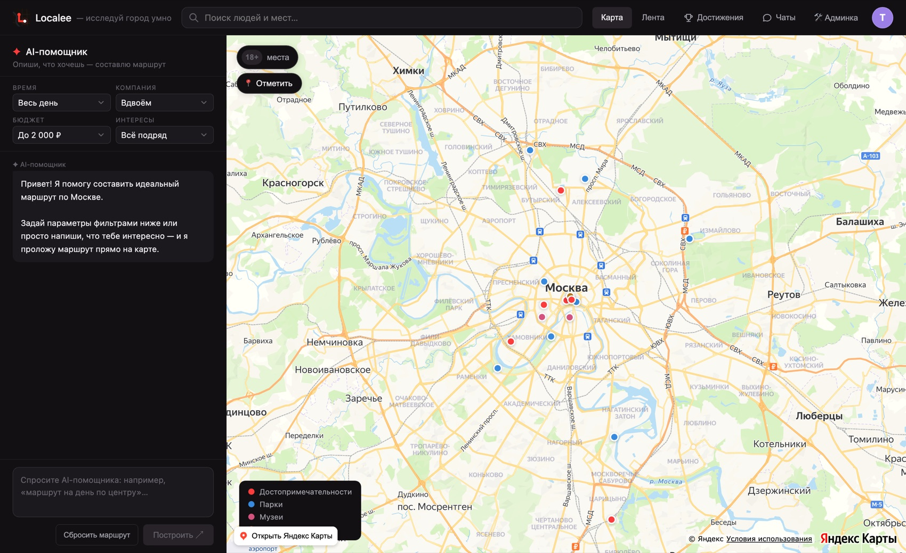

<div align="center">

  

  <h1>Localee</h1>

  <p><b>Гид по Москве, который собирает маршрут под тебя</b><br>
  Не список «топ-10 мест», а конкретный план на день — под твоё время, бюджет и компанию.</p>

  <p>
    <a href="https://localee.ru"><b>Открыть localee.ru</b></a>
  </p>

  <p>
    
    
    
    
    
  </p>

</div>

---

## Зачем это

Планировать прогулку по городу неудобно. Подборки в интернете не знают, сколько у тебя времени
и денег, отзывы разбросаны по разным сайтам, а карта не понимает, что ты идёшь вдвоём и хочешь
уложиться в три часа.

Localee делает наоборот: ты задаёшь рамки — время, бюджет, компанию, интересы — и получаешь
маршрут прямо на карте. Рядом живёт социальная часть: лента, друзья, чаты и метки от других
людей, потому что город меняется быстрее любого справочника.

## Как выглядит

<div align="center">
  
  <p><i>Главный экран: карта, места по категориям и AI-помощник</i></p>
</div>

Есть и нативное приложение для iPhone — оно в отдельном репозитории
[localee-ios](https://github.com/term1x1/localee-ios) и ходит в этот же бэкенд.

<div align="center">
  
  &nbsp;&nbsp;&nbsp;
  
</div>

## Что умеет

**Места и маршруты**
- Карта на Яндекс.Картах: достопримечательности, парки, музеи, рестораны, развлечения — каждая категория своим цветом
- Фильтры по времени, бюджету, компании и интересам
- Раздел 18+ скрыт, пока сам не включишь
- Метки от пользователей: скопления, сходки, дрифт — живут сутки и исчезают

**Люди**
- Лента постов: текст, до 10 фотографий и документы в одной записи
- Лайки, комментарии, пересылка постов в чат
- Друзья, чужие профили, поиск людей
- Личные чаты и группы: ответы, реакции, редактирование, пересылка, статус прочтения
- Достижения за посещённые места — общие для сайта и приложения

**Порядок**
- Жалобы на посты, комментарии и сообщения — с причиной и пояснением
- Админка: разбор жалоб, блокировка на срок или навсегда, роли
- Ограничения на регистрации, посты и сообщения — против ботов
- Проверка вложений на сервере: под видом картинки не подсунуть что попало

## Как устроено

Один бэкенд обслуживает сразу двух клиентов — сайт и приложение. Всё, что появляется в API,
должно оставаться совместимым с обоими сразу.

```
                     ┌──────────────────┐
     localee.ru ────►│                  │
    (React + Vite)   │  api.localee.ru  │──► SQLite (данные)
                     │  Node + Express  │──► data/uploads (файлы)
  iOS-приложение ───►│                  │
  (Swift / SwiftUI)  └──────────────────┘
```

**Сайт** — React 19 и TypeScript, сборка Vite. Карта на Яндекс JS API 3. Интерфейс на русском
и английском, светлая и тёмная тема.

**Сервер** — Node и Express, база SQLite через `better-sqlite3`. Вход по JWT, пароли под bcrypt.
Никаких внешних сервисов: всё живёт на одной машине.

**Файлы.** Картинки и документы лежат на диске, в базе остаётся ссылка. Имя файла — sha256 его
содержимого: одинаковые файлы не дублируются, а содержимое по адресу неизменно и кешируется
навсегда. Раньше всё хранилось строкой base64 прямо в базе, и два поста с фотографиями раздували
её с 1,6 до 6,9 МБ. После переезда база весит 164 КБ.

### Структура

```
src/                  сайт (React)
  components/         экраны и компоненты
  utils/api.ts        клиент API — единственное место, где знают про сервер
  i18n/               переводы (ru / en)
server/
  src/routes/         маршруты API
  src/db.js           схема и миграции
  src/storage.js      файловое хранилище
  src/moderation.js   жалобы и блокировки
  backup.sh           бэкап базы вместе с файлами
```

## Запуск локально

Нужен Node 20 или новее.

```bash
# бэкенд
cd server
cp .env.example .env
npm install
npm run seed     # демо-пользователи: anna, maxim, localee — пароль demo1234
npm run dev      # http://localhost:4000
```

```bash
# сайт, в другом окне терминала
npm install
npm run dev      # http://localhost:5173
```

Сайт по умолчанию ходит в `http://localhost:4000`, отдельно настраивать ничего не нужно.

### Ключи

В репозитории ключей нет — он публичный. Нужны два файла:

| Файл | Что внутри | Зачем |
|---|---|---|
| `.env.local` | `VITE_YANDEX_JS_KEY=…` | карта на сайте |
| `server/.env` | см. `server/.env.example` | секрет токенов, путь к базе, админы |

Без ключа карты сайт запустится, но вместо карты покажет подсказку.

## Деплой

**Сайт** — статика: `npm run build`, содержимое `dist/` заливается в корень хостинга.

**Бэкенд** — VPS, systemd-юнит `localee-api`, за nginx.

```bash
ssh root@<сервер>
cd /opt/localee && sudo -u localee git pull
cd server && sudo -u localee npm install --omit=dev
systemctl restart localee-api
```

Проверка: `curl https://api.localee.ru/api/health`

Бэкап базы вместе с файлами — `sh /opt/localee/server/backup.sh`. База снимается штатным
онлайн-бэкапом SQLite, а не копированием файла: она работает в режиме WAL, и обычная копия
на живом сервере может выйти неполной.

## Создатели

Делаем вдвоём — и сайт, и приложение, и бэкенд.

<div align="center">
  <table>
    <tr>
      <td align="center" width="200">
        <a href="https://github.com/HovhannisyanGor">
          <br>
          <b>Гор Оганнисян</b>
        </a><br>
        <sub>@HovhannisyanGor</sub>
      </td>
      <td align="center" width="200">
        <a href="https://github.com/term1x1">
          <br>
          <b>Эрик Жамкочян</b>
        </a><br>
        <sub>@term1x1</sub>
      </td>
    </tr>
  </table>
</div>

Проект начат в июле 2026 года.

## Статус

Сайт работает на [localee.ru](https://localee.ru). Приложение для iPhone собрано и работает,
готовится к публикации.

Дальше: подтверждение почты и восстановление пароля, маршруты от ИИ-помощника, Android.
